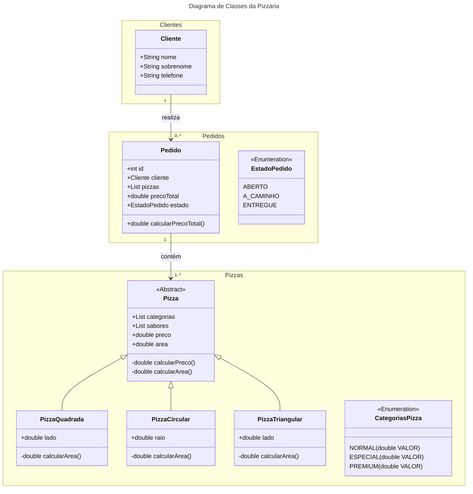

# 🍕 Pizzaria 3 Amigos

Um empreendedor resolveu criar uma pizzaria diferente das que existem no mercado. A sua ideia é vender pizza em centímetro quadrado, no lugar das tradicionais pequena, média e grande. Além disso, também resolveu inovar na forma da pizza que pode assumir a forma tradicional circular, um quadrado, ou um triângulo. O preço de cada pizza será definido pela área em centímetros quadrados, cruzado com o tipo da pizza (dependendo dos ingredientes). Os sabores das pizzas estão divididos em Simples, Especial e Premium.

- [🍕 Pizzaria Final Project](#-pizzaria-final-project)
  - [📋 Features](#-features)
  - [🛣️ Roadmap](#️-roadmap)
  - [📊 Diagrama de Classes](#-diagrama-de-classes)
  - [🚀 Como executar o projeto](#-como-executar-o-projeto)
  - [📁 Estrutura do Projeto](#-estrutura-do-projeto)

## 📋 Features

1. **Cadastro de Clientes**
    - Listar, atualizar e excluir clientes.
    - Filtrar clientes por sobrenome, parte do sobrenome e/ou telefone.

2. **Realização de Pedidos**
    - Escolha de cliente e itens do pedido.
    - Escolha da forma e dimensões da pizza.
    - Cálculo do preço total da venda.
    - Armazenamento dos pedidos e seus estados.

3. **Atualização de Preços**
    - Tela para atualizar o preço do centímetro quadrado de cada tipo de pizza.

4. **Cadastro de Sabores**
    - Tela para cadastrar os sabores das pizzas e relacionar cada sabor ao tipo da pizza.

5. **Gestão de Pedidos**
    - Visualização e alteração do estado dos pedidos.

6. **Validações e Tratamento de Exceções**
    - Validações nos campos das telas e tratamento qualificado das exceções.

## 🛣️ Roadmap

- [x] Implementar cadastro de clientes.
- [x] Implementar realização de pedidos.
- [x] Implementar cálculo do preço total da venda.
- [x] Implementar armazenamento dos pedidos e seus estados.
- [x] Implementar imagens e estilos nas telas.
- [x] Implementar validações nos campos das telas.
- [x] Implementar tratamento qualificado das exceções.
- [x] Implementar atualização de preços.
- [x] Implementar gestão de pedidos.
- [x] Melhorar interface do usuário.
- [ ] Implementar cadastro de sabores.
- [ ] Adicionar mais testes unitários.

## 📊 Diagrama de Classes



## 🚀 Como executar o projeto

1. Clone o repositório.

```bash	
git clone https://github.com/seuusuario/PizzariaFinalProject.git
cd PizzariaFinalProject
```

2. Construa o projeto usando Maven.

```bash
mvn clean install
```

3. Execute o projeto.

```bash
java -jar target/pizzaria-final-project-0.0.1-SNAPSHOT.jar
```

## 📁 Estrutura do Projeto

```
PizzariaFinalProject/
└── src/
    ├── main/
    │   ├── java/
    │   │   ├── com/
    │   │   │   └── br/
    │   │   │       └── pizzaria/
    │   │   │           ├── cliente/          # Pacote contendo classes relacionadas aos clientes
    │   │   │           ├── pedido/           # Pacote contendo classes relacionadas aos pedidos
    │   │   │           ├── pizza/            # Pacote contendo classes relacionadas às pizzas
    │   │   │           └── App.java          # Classe principal para execução da aplicação
    │   │   └── module-info.java              # Arquivo de configuração do módulo Java
    │   └── resources/
    │       ├── com/
    │       │   └── br/
    │       │       └── pizzaria              # Recursos estáticos da aplicação
    │       └── MANIFEST.MF                   # Arquivo de manifesto do projeto
    ├── pom.xml                               # Arquivo de configuração do Maven
    └── README.md                             # Este arquivo de documentação
```
