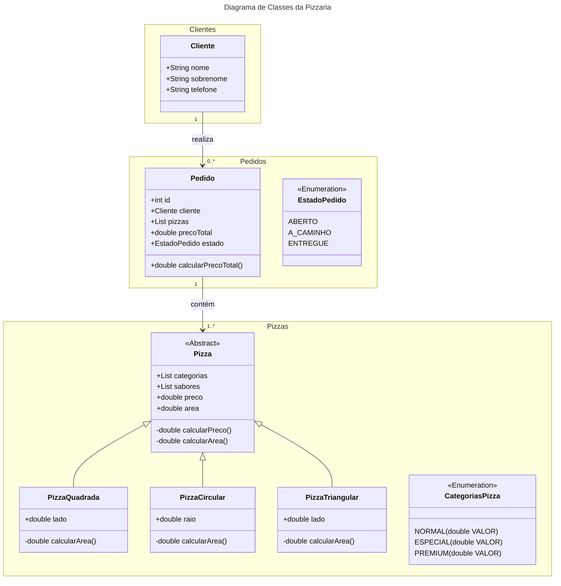

# 🍕 Pizzaria Final Project

Um empreendedor resolveu criar uma pizzaria diferente das que existem no mercado. A sua ideia é vender pizza em centímetro quadrado, no lugar das tradicionais pequena, média e grande. Além disso, também resolveu inovar na forma da pizza que pode assumir a forma tradicional circular, um quadrado, ou um triângulo. O preço de cada pizza será definido pela área em centímetros quadrados, cruzado com o tipo da pizza (dependendo dos ingredientes). Os sabores das pizzas estão divididos em Simples, Especial e Premium.

- [🍕 Pizzaria Final Project](#-pizzaria-final-project)
  - [📋 Features](#-features)
  - [🛣️ Roadmap](#️-roadmap)
  - [📊 Diagrama de Classes](#-diagrama-de-classes)
  - [🚀 How to run the project](#-how-to-run-the-project)
  - [📁 Project Strucure](#-project-strucure)

## 📋 Features

1. **Cadastro de Clientes**
    - Listar, atualizar e excluir clientes.
    - Filtrar clientes por sobrenome, parte do sobrenome e/ou telefone.

2. **Realização de Pedidos**
    - Escolha de cliente e itens do pedido.
    - Escolha da forma e dimensões da pizza.
    - Cálculo do preço total da venda.
    - Armazenamento dos pedidos e seus estados.

3. **Atualização de Preços**
    - Tela para atualizar o preço do centímetro quadrado de cada tipo de pizza.

4. **Cadastro de Sabores**
    - Tela para cadastrar os sabores das pizzas e relacionar cada sabor ao tipo da pizza.

5. **Gestão de Pedidos**
    - Visualização e alteração do estado dos pedidos.

6. **Validações e Tratamento de Exceções**
    - Validações nos campos das telas e tratamento qualificado das exceções.

## 🛣️ Roadmap

- [x] Implementar cadastro de clientes.
- [x] Implementar realização de pedidos.
- [x] Implementar atualização de preços.
- [x] Implementar cadastro de sabores.
- [x] Implementar gestão de pedidos.
- [ ] Melhorar interface do usuário.
- [ ] Adicionar mais testes unitários.

## 📊 Diagrama de Classes



## 🚀 How to run the project

1. Clone the repository.

```bash	
git clone https://github.com/yourusername/PizzariaFinalProject.git
cd PizzariaFinalProject
```

2. Build the project using Maven.

```bash
mvn clean install
```

3. Run the project.

```bash
java -jar target/pizzaria-final-project-0.0.1-SNAPSHOT.jar
```

## 📁 Project Strucure

```
PizzariaFinalProject/
├── src/
│   ├── main/
│   │   ├── java/
│   │   │   └── com/
│   │   │       └── br/
│   │   │           └── pizzaria/
│   │   │               ├── App.java
│   │   │               ├── clientes/
│   │   │               ├── pedidos/
│   │   │               └── pizzas/
│   └── test/
│       ├── java/
│       │   └── com/
│       │       └── br/
│       │           └── pizzaria/
├── pom.xml
└── README.md
```